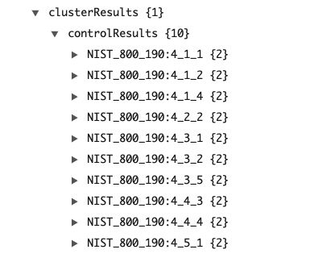
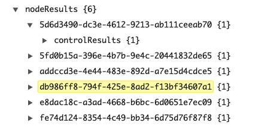

# Get started
1. `npm install`
2. `npm start`

# Improvement
- Since the API call to `/report-scc/scan` would normally take more than 11 seconds based on ACS compliance report for node, deployment and cluster, the main time taken is for awaiting for the scanning report to 'FINISHED'. This could be potentially enhanced by applying a webhook for 'FINISHED' event.

- Decouple the frontend and backend, config frontend into nginx proxy.

- Remediation script is missing, and needs to figure out how to enable.

- Severity seems not controllable.

# Steps snippet
```bash
[middelware/reportScc] Thu, 09 Sep 2021 00:23:41 GMT
 1. ACS report scanning triggered
[middelware/reportScc] Thu, 09 Sep 2021 00:23:42 GMT
 2. ACS report scanning checked
{
  "invalidRunIds": [],
  "runs": [
    {
      "id": "09233a8a-a5ee-4420-beda-eb857458fbf8",
      "clusterId": "6a61803d-0b2f-41e0-8202-637af673618f",
      "standardId": "HIPAA_164",
      "scheduleId": "",
      "startTime": "2021-09-09T00:23:41.122296799Z",
      "finishTime": null,
      "state": "WAIT_FOR_DATA",
      "errorMessage": ""
    }
  ]
}
[middelware/reportScc] Thu, 09 Sep 2021 00:23:43 GMT
 2. ACS report scanning checked
{
  "invalidRunIds": [],
  "runs": [
    {
      "id": "09233a8a-a5ee-4420-beda-eb857458fbf8",
      "clusterId": "6a61803d-0b2f-41e0-8202-637af673618f",
      "standardId": "HIPAA_164",
      "scheduleId": "",
      "startTime": "2021-09-09T00:23:41.122296799Z",
      "finishTime": null,
      "state": "WAIT_FOR_DATA",
      "errorMessage": ""
    }
  ]
}
[middelware/reportScc] Thu, 09 Sep 2021 00:23:44 GMT
 2. ACS report scanning checked
{
  "invalidRunIds": [],
  "runs": [
    {
      "id": "09233a8a-a5ee-4420-beda-eb857458fbf8",
      "clusterId": "6a61803d-0b2f-41e0-8202-637af673618f",
      "standardId": "HIPAA_164",
      "scheduleId": "",
      "startTime": "2021-09-09T00:23:41.122296799Z",
      "finishTime": "2021-09-09T00:23:43.939417759Z",
      "state": "FINISHED",
      "errorMessage": ""
    }
  ]
}
[middelware/reportScc] Thu, 09 Sep 2021 00:23:46 GMT
 3. ACS report scanning FINISHED
[middelware/reportScc] Thu, 09 Sep 2021 00:23:46 GMT
 4. ACS result translated into SCC payload
[middelware/reportScc] Thu, 09 Sep 2021 00:24:14 GMT
 5. SCC report sent
{
  "statusCode": 201,
  "data": {
    "success": true,
    "message": "Successfully processed validation request for : CBACCEPConnection"
  }
}
POST /report-scc/scan 200 33498.977 ms - 123585
```

# Demo

## Input & Output
- input:
Request body:
```json
{
    standardId: "HIPAA_164"
}
```
Environment variables
```bash
NODE_ENV=production

ACS_SERVER_URL=xxx

STACKROX_API_TOKEN=xxx (ACS API token)

TANIUM_API_KEY=xxx (For automatically update IBM IAM token to connect to SCC)

SCC_EXCHANGE_PROTOCOL_URL=xxx
```

- output:
    - APIs:
        * /report-scc/standards GET
        * /report-scc/scan POST
    - Web UI: https://cba-cppe-cba-cppe.cba-cppe-test-d0888eb2f890b866b1dc8b198c11d221-0000.au-syd.containers.appdomain.cloud/ 

## ACS Result
- Overall Structure

    
- clusterResults

    

- nodeResults

    

- deploymentResults

    


- Data payload for SCC
Details in utils/reportScc.js

    - Tanium Client IP Address: `results.domain.cluster.id`
    - Computer Name: `ACS-TaCo for ${_.get(acsResults, 'results.domain.cluster.type')}-${_.get(acsResults, 'results.domain.cluster.name')}`, in this example: Type: "OPENSHIFT4_CLUSTER", Cluster Name: "demo-cluster"
    - Comply - Compliance Findings: 
        ```javascript
            Check ID: "ACS CIS_Docker_v1_2_0;1.0"
            Rule ID: "Node does not use Docker container runtime"
            State: "notchecked"
        ```
        where 
        - Check ID: `ACS ${standardId};1.0`
        - State: `acsReportStateMap[evidenceObj.state]`,
        - Rule ID: `evidenceObj.message`

- How SCC payload is translated
    - Node Results: all
    - ClusterResults: all
    - DeploymentResults: First 15 items because there could be ~1300 records, and the API itslef now might take very long time. (Webhook needed from ACS), also some records after 15 items might need to be translated carefully as it would potentially cause 500 error from SCC. (More debugging efforts)